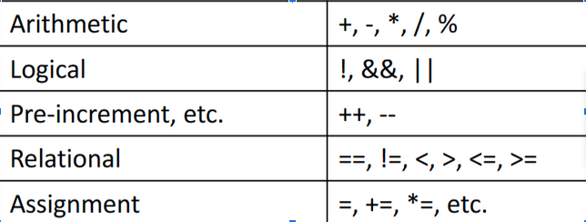
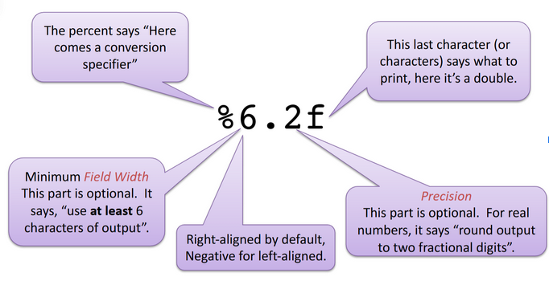
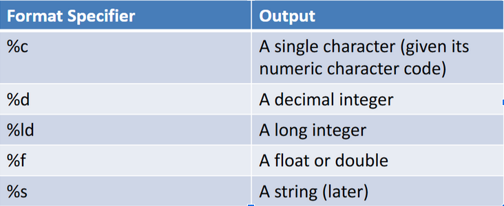
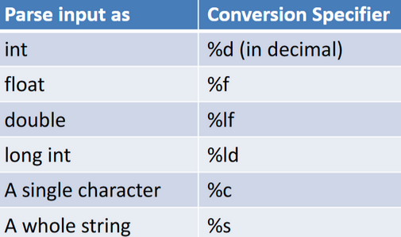
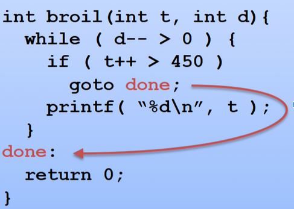
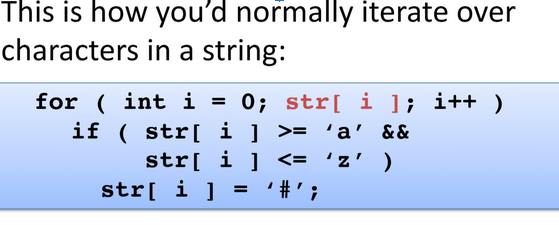

# C

## Things that are the exact same as Java

- Variable declarations
  - Are able to use char, short, int, long, float, and double
- Can’t use byte and boolean
- 
- If statements
- For loops
- While loops
- Switch statements
- Break and continue statements
- Functions
- Ex. 

## New things

### Methods

- **getchar()** - returns an ASCII int of the next character read
- **int putchar( int c )** sends one character to the terminal; used with studio.h
- **bool isalpha( int ch );** checks if a character is a letter
- **bool isspace( int ch );** checks if a character is whitespace
- **bool isdigit( int ch );** checks if a character is a digit
- **bool isprint( int ch );** checks if a character is printable (not a control character)
- **int toupper( int ch );** converts to uppercase
- **int tolower( int ch );** converts to lowercase
- **sizeof( var )** returns the size of the variable

### Constants for Exit Status

- main() has a return type of int so program success returns 0, failure returns non-zero
- Can also use **return EXIT_SUCCESS** or **return EXIT_FAILURE**
- These are both defined in **stdlib.h** which can be included with **#include \<stdlib.h>**

### Using the Standard Library

- Have to include header files at the top of a file to give access to parts of the library
- Most general language features are in **standard-lib(#include \<stdlib.h>)**
- For Input and Output, need I/O header(**#include \<stdio.h>**)
- **#include** lines are called **preprocessor directives** which tells the compiler to read these files first in order to understand the rest of the source code

### Exiting from Anywhere

- Can use return inside main to exit but can’t in other functions
- Use the exit function instead(**void exit( int status)**) which is in the stdlib.h header
- 0 for **EXIT_SUCCESS**
- 1 for **EXIT_FAILURE**

### Streams

- A stream is a file or device we can read or write
  - Standard input is input typed in the terminal
  - Standard output is output to the terminal
  - Standard error is more output to the terminal

### Redirecting Standard Streams

- From the terminal, you can redirect input from a file(Ex. **$ myProgram < input_file.txt**)
- Or standard output to a file (Ex. **$ myProgram > output_file.txt**)

### Working with Characters

- The **ctype.h** header declares many functions working with characters
- **bool isalpha( int ch );** checks if a character is a letter
- **bool isspace( int ch );** checks if a character is whitespace
- **bool isdigit( int ch );** checks if a character is a digit
- **bool isprint( int ch );** checks if a character is printable (not a control character)
- **int toupper( int ch );** converts to uppercase
- **int tolower( int ch );** converts to lowercase

### Formatted Output

- The **printf()** function is used for generating formatted output
- 
- 
- Ex. **printf( "%6d\n", val );**

### Reading Formatted Input

- **scanf()** is used for reading formatted input
- It can skip whitespace and other input you tell it to ignore
- **int scanf( const char \*fmt, more…args )**
- Ex. **scanf( “%d”, &val );** & symbol has to go in front of args
- Can pass in multiple conversion specifiers
- Ex. **scanf( “%f%d”, &floatVal, &intVal );**
- This method returns the number of specifiers matched
- 

### Defining Constants

- **#define SIZE 25** with no semi-colon at the end

### Style Guidelines

- Javadoc block at top of file with summary of program, @file for file name, @author with name and unity ID
- Javadoc block at top of each function with function summary, @param tag, @return tag
- Javadoc comment for each constant
- Curly braces have to go on next line beneath functions
- No indentations, only spaces
- Avoid global variables

### GDB

- GDB is the debugger for C,C++ and other programs
- GDB lets you run and resume your program’s execution and set breakpoints at particular source lines
- This can be used with the **-g** flag (Ex. **$ gcc -Wall -std=c99 -g myProgram.c -o myProgram**)

### Running GDB

- Tell GDB to work with our program (**$ gdb ./myProgram**)
- Can set breakpoints by function name or line number (**(gdb) break someFunctionName** or **(gdb) break 25**)
- When ready, you can run it with **(gdb) run**
- Can also do I/O redirection (**(gdb) run < input-file.txt > output-file.txt**)
- Can run **(gdb) backtrace** to look at a list of functions that got you to that point

### Looking Around with GDB

- Can look at a value using **print var** (Or any expression)
- Can also change the value of a variable too with **set variable var = newValue**
- Can also put in **up** or **down** to move around in a stack frame
- Can look around at surrounding source lines using **list**
- Can also use **list** for any function you want with **list someFunctionName**
- Can also use -tui to show source code to terminal (**gdb -tui ./myProgram**)

### Resuming execution

- Resume using **continue**
- Run to the next instruction/breakpoint using **next**
- You can step into a function using **step**
- Can run ahead to any line you want using **until lineNumber**
- Run until the program finished using **finish**
- Can kill it using **kill** to leave in the middle of running
- Quit gdb back to shell using **quit**

### Checking the Repo Status

- Use **git status** to tell us what files we’ve changed and need to commit
- Can stage files using **add** (**git add primes\*.c**)
- When ready to commit, run **git commit**
  - Can add **-a** to automatically add tracked files
  - Can add **-m** to add a commit message
  - Ex. **$ git commit –am “Fixed bugs in prime programs.”**
- Finally, do **git push** in order for the files to be seen in the git repo
- Can do **git pull** to pull new changes

### Goto

- Used instead of break in C
- 

### Header Files

- Basically an interface in C
- Put all the methods and variables you want in header files
- For files implementing the header files, include **#include “header_name”**

### Arrays

- Declaring an array can be done with **type arr_name[ size ]; **
- Can also initialize an array full of elements like **type arr_name[ size ] = { elements };**

### Working with strings

- A string is stored as a char array
- Has a zero byte(**\0**) to mark the end of a string
- Can be initialized with **char arr_name[ size ] = “string”;** Can also put no size
- Need enough space for the string length and the null terminator
- 
  Don’t need an & sign when passing into printf() function

Using string functions
Use library #include <string.h>
strlen( char array) obtains string length
Strlen gets size of string, sizeof gets size of whole array
strcpy(char dest[], char src[]); copies from src to dest
strncpy(char dest[], char src[], size_t n); Limits the number of characters written to dest. Pads with 0’s up to n
Won’t null terminate if it runs out of room
strcmp( char s1[], char s2[] ); compares strings
Returns less than 0 if s1 before s2
Returns greater than 0 if s1 after s2
Returns 0 if equals
Stops when it hits null terminator or char where they differ
strcat( char dest[], char src[]); copies the string from src to end of dest
Overwrites the null and adds it to the end
strncat( char dest[], char src[], size_t n); lets you put a bound on string being appended
atoi(char str[]); parses an int out of a string (declared in stdlib.h)
atof(char str[]) for doubles
atol(char str[]) for long ints

File I/O and Strings

FILE *stream = fopen( “file-name.txt”, “r” );
To open a file
Returns null on failure
Can do r for read or w for write
int fprintf(FILE *stream, const char *format, ...);
int fscanf(FILE *stream, const char *format, ...);
int fclose( FILE *stream );
int fgetc(FILE *stream);
int fputc(int ch, FILE *stream);
int ungetc(int c, FILE *stream);
Pushes character back onto the given stream
Clears the EOF condition
int rewind( FILE *stream );
To reread or rewrite a file from the start
fprintf( stderr, "Can't open input file\n" );
scanf( “%[A-Z]”, str );
Can put in exactly what characters to match
Here we’re looking for any uppercase characters
Can also do a-z
scanf( “%[^\n]”, str );
^ allows us to negate characters so this is anything but a newline
scanf( “ %c”, &ch );
Skips whitespace then reads a character (Because of the space in front of %c
sscanf( buffer, “%d%f”, &iVar, &fVar );
Allows you to parse the contents of a string
Can also include the %n identifier to report how many characters it’s read so far

Command Line Arguments

int main( int argc, char \*argv[] )
argc is the number of arguments(including the file call)
argv is the array of the command line arguments

Dynamic Memory Allocation

int _list = (int _) malloc(1000 * sizeof(int));
This allocates a 1000-element array of ints
Free memory with void free (void *ptr)
Do free(list) to free the list we created
Void *realloc(void *ptr, size*t size);
The pointer is to previous memory then the size is the size we need now
Ex. list = (int *) realloc( list, capacity _ sizeof(int));
void *memcpy( void *dest, void const *src, size_t n );
void *memmove( void *dest, void const *src, size_t n );
void \_memset( void _, int c, size_t n );

Pointers

Void qsort(void *base, size_t nmemb, size_t size,int(*compar)(const void _,const void _));
Base is the start of the array
Nmemb is the number of items
Size if the size of each item
Compar is the comparison rule which returns negative, zero, or positive
Ex. qsort(list, 8, sizeof(list[0]), myComp);(The function compares two elem)

Structs

struct Person {
char name[10];
double height;
int age;
};

struct Person p1 to initialize a struct
Or struct Person p2 = { “William”, 1.85, 27 };
Access fields like p1.height = 1.75;
Can’t do p1.name = “Mary”, can only initialize when first creating an instance or scanf

struct Grade {
double minimum;
char letter;
} aGrade = { 90.0, ‘A’ };

Can declare struct variables along with the struct definition and can also take away the structure name if you won’t ever use it again
If a struct is passed as a pointer, you can use the arrow (->) instead of a dot
Ex. Instead of (\*ptr).field we can do ptr->field

Dynamically Allocating Structs

struct Event _e = (struct Event _) malloc( sizeof( struct Event));

typedef

Make a complicated name shorter using typedef
Ex.

typedef int Row[ 20 ];
Row _table;
table = (Row _) malloc( 50 \* sizeof( Row ) );

With structs:

struct EventStruct {
char name[ 10 ];
int hour, minute;
};

typedef struct EventStruct Event;

Event evt1 = { “Map”, 2, 5 };

Can also do:

typedef struct EventStruct {
char name[ 10 ];
int hour, minute;
} Event;

Valgrind
valgrind --tool=memcheck --leak-check=full ./tcrypt key-b.txt plain-b.txt output.bin
For memory errors
valgrind --track-fds=yes ./tcrypt key-b.txt plain-b.txt output.bin
For open files

Bit Operations
Friends of ~
~ flips all bits
! swaps true and false (111100011 becomes 00000000)

- performs the two’s complement operations
  Operators
  & is a bitwise and (1 only results if both inputs are 1)
  ^ is a bitwise exclusive or (a 1 only results if both inputs are different)
  | is a bitwise inclusive or (1 results if either input is a 1)
  Shift operators
  << x or >>x shifts bits to the right or left by x amount
  Get new zeroes on the end of where it was shifted from or ones if signed

Masks are useful to only get certain bits you want
Ex. 11010011 & 11110000 returns 11010000
Then you can do 11010000 >>4 to get 00001101
Could also choose to flip certain bits with ^ by placing 1’s where you want bits flipped
Ex. 01101100 ^ 11001010 returns 10100110

Use %x to read in a number as hexadecimal
Use %hx to read a value directly into an unsigned short

Binary IO
Use rb or wb to open and read or write a binary file
size_t fwrite(const void *ptr, size_t size, size_t nmemb, FILE *stream);
ptr is the array to write from
size is the size of each element
nmemb is the number of elements
stream is the stream to write to
size_t fread(void *ptr, size_t size, size_t nmemb, FILE *stream);

stdlib

void perror( const char \*s ) : has short messages that it knows
Ex. perror( “someFile.txt”);
returns “someFile.txt: No such file or directory.”
#include <math.h>
link with gcc -Wall -std=c99 program.c -o program -lm
M_E Base of the natural logarithm
M_PI You know, π
M_SQRT2 Square root of 2
sin( x )
tan( x )
asin( x )
atan( x )
atan2( y, x )
exp( x )
exp2( x )
exp10( x )
log( x )
log2( x )
log10( x )
pow( x, y )
sqrt( x )
round( x ) nearest integer (as a double)
fabs( x ) absolute value
floor( x ) largest integer no larger than x (as a double)
ceil( x ) smallest integer no less than x (as a double)
fmod( x, y )

Enumerations
enum ColorEnum { red, green, blue, orange }
enum ColorEnum myColor = green;
These are indexed with the first color having a value of 0 and the last one with 3
typedef enum { up, down, left, right } Direction;
Direction myDirection = right;
