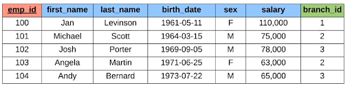

# SQL

### Databases

- There are two types of databases:
  - Relational Databases(SQL) organize data into one or more tables with each table having columns and rows as well as a unique key identifying each row. This is like an Excel spreadsheet
    - Can be used with Relational Database Management Systems(RDBMS) such as mySQL, Oracle, postgreSQL, mariaDB, etc.
  - Non-Relational (noSQL) organizes data in anything but a traditional table. This can be with key-value stores, documents like (JSON, XML, etc.), graphs, and flexible tables
    - Can be used with mongoDB, dynamoDB, apache cassandra, firebase, etc.

### Variable Types

- INT - Whole Numbers/integers
- DECIMAL(m, n) - Decimal numbers
  - The m is the total number of decimal places
  - The n is the number of decimal places after the decimal point
- VARCHAR(l) - This is for strings
  - l is how many chars you want your string to be
- BLOB - Binary large objects
- DATE - ‘YYYY-MM-DD’
- TIMESTAMP - ‘YYYY-MM-DD HH:MM:SS’

### Creating/Modifying Data Tables

- Primary Keys are the unique keys that distinguish the different rows - For example, if some data in the rows were exactly the same, you need to have a way to distinguish between the two so this is where unique keys come in
  -  The primary keys are in red
  - The column in green is called the foreign key which links us to the primary key of another table
- Syntax: **CREATE TABLE tableName(tableData);**
- Ex. **CREATE TABLE student(**
  - **student_id INT PRIMARY KEY,**
  - **name VARCHAR(20),**
  - **major VARCHAR(20)**
- **);**
- Instead of putting PRIMARY KEY right after the field, you can put it all the way down at the bottom like **PRIMARY KEY(student_id)**. Can also do two fields like **PRIMARY KEY(student_id, major)** for a composite key
- To delete a table, simply do **DROP TABLE tableName;**
- **ALTER** keyword allows you to add, delete, or modify columns in a table
- To add another column to an existing table, do **ALTER TABLE tableName ADD columnName columnType;**
- You can also drop a column using **ALTER TABLE tableName DROP COLUMN columnName**
- You can introduce a foreign key like **FOREIGN KEY(fieldName) REFERENCES foreignTableName(foreign field being referenced)**

### Inserting Data

- To insert data into an existing table, do **INSERT INTO tableName(columnNames of what you want required(you don’t have to put these column names if you want all of them))VALUES(values);**
- Ex. **INSERT INTO student(student_id, name) VALUES**
- **(1, ‘Jack’, ‘Biology’),**
- **(2, ‘Kate’, ‘Sociology’);**

### Constraints

- Constraints can be added at the end of a field when adding one to a new table
- **NOT NULL** can be added after any field when creating a table to make sure that a value ALWAYS has to be there when inserting data
  - Ex. **name VARCHAR(20) NOT NULL;**
- **UNIQUE** can be added after any field when creating a table to make sure that each value inserted is unique
  - Ex. **major VARCHAR(20) UNIQUE;**
- **DEFAULT** is used to specify a default value if one is not given
  - Ex. **major VARCHAR(20) DEFAULT ‘undecided’;**
- **AUTO_INCREMENT** can be added to automatically increment instead of you having to do it yourself when inserting data
  - Ex. **student_id INT AUTO_INCREMENT;**

### Update and Delete Rows

- UPDATE and DELETE can be used to modify rows
- Update using **UPDATE tableName**
  - Ex. **UPDATE student**
  - **SET major = ‘Bio’, name = ‘John’**
  - **WHERE major = ‘Biology’**
- Delete using **DELETE FROM tableName;** which would delete all the rows in tableName
  - Ex. **DELETE FROM student**
  - **WHERE student_id = 5;**

### Keyword Library

![Keyword order table](data:image/webp;base64,UklGRnYbAABXRUJQVlA4IGobAACwbwCdASpVAbAAPp1GnEolo6MhqdHMULATiWduwNYA5p/3tfPPU/nyZ7RHoA5kTWZfS/98/kXdB/bv7b+0/oL+M/LP4P81v7l7HVb5/i+hX8n+1v7b+6e279T/0ng3+Rfnv+59QL8T/ln+l/q2/K5v/k/QC9bvon/J/vf5QegV/T/4j1E/H/6L/kfuV+wD+Of0H/QeoX93/0Xi7fPf7L/2/798AP8h/nH+a/un4+/TX/If+L/Lfmf7Nfzv/Ef+L/Mf6b5Av5j/X/+7/gfbB///uE/aL/9+5f+wv/2/fUUT2twqiwN6WTVECFq0tLjAXBV1ecdJHD2QwKb48VrHHRC/KCuE75g9cyy49yeuXkQt9uCnfA13l2knzkbMc1zm6TV5RQtK/n4zQPrmYJR9rTFU6b6FKo6tnUcSw4Ry6Jqsg8bCLfQViZvFGItM3QLP5dpJ85HiC0alACrp6gWeq73JyZtb+v7waZoiwpXt7FAHVh0GFzWGdl8xe+8jZEi49nPzGlhAoDJlKO+YevG1srUxTuOeKv9rHDXxJPKyLyZEw3gac/37k5UZQGQ2KNDC7x9dQ+cilsbBSL0aepwL2Pn4y3vSj61XQhTTPyMhtW3s0N0ydzaYOPXlLDcTrZqH03Ci/xESRSJceXU1WKxqKjHNbWfRARB6HsGIz2WytM1T1ihO5R735IxqNenWrAy30Z8eBFA3bl04z8+AoVC6p2w7JlUpY/O9zZ3R9vZKozYA5NbbZZS6KyCGbltbMjWQk9ZAdipydtJMLwZvjIDifiQrN/OCqr8tlxBkIJZyUQSvT23pBgeXd5em/+rLRaR/f7dkGDDQciGf96Hf848fT/fwu8W27Ech6ihYwARchUA9vlbyExVCHnSQR6AAzOogx717QL9IaDJDc5fHDtqMnput23V62h+VgQwUPVVLh5q4N2gBIIVYXJdicFzdFozYNkdMrGczI3py/GL4xAldQV7eL95RA6oH93B5RCRS4EbFlMpAMQQl6O9xO3hdh/Yh2FZ0sdcnmFQyWV30eKOQY841IRHvxblnXphtSDNRVzeB1bOlmpZFvD3PFlW/NCj24lBpFVdp6GTAoAnF7UudjWeo1ky7nHSxKXTbvOOVpo77yRtjELhN00HZICM5UcNic7/z0V0H8SH8TQVj0nj+zdRwac8wFfvTCOJ0jtc8sCpqaFYcBGf/UAD7EWZoHg2tALgqeIszpooeH0XKDzkBc7cAXzvNdMz4T4y5/8wWrXi6s127I7a5o/fqaWqr1vapPByB6uYj6QDWD9QQLDnoDAKydKWhJBySGQvAnILOgBN70M7Zu73i5LIu5H+cSbhR8CDSgBvwGIfZfSfH4iJCu70zUTP+IACOZiVfGRLl3jpkQyIIPdQe0eyLRoJp24gvyw8BSAEjEDVL7YskDfFCrM+jXglMna0K1C0nTgffvjLDeV/19VQpIFHt7Jx5rpvmm3b+w6/LHxrx1k7e/CKCZa4U5HGBobLKzvjDHri93oWZI+6qKP0iyo6zIRS7qRlU8ZgbuP78svr0cWLUws9+s23dtLV/+FqrhuiKfAY3pYo2yYbMUcZUzxyoF+XXY6oGWIY6cCwoDGbfQByzHQ3igZl6CxZLeN1ScBaoBp3zW2E4+e58F0zU4EW8qHNkXN8sjBCTNicTTqlf1bFK+h3SGqDEM8TrIqmRlo5aV0cIuPeKV1dB1Jv4mqVMJLRC8LnvhakDtNCI499Pn/4SUMKMCgXmwCPfmuo7hHJI05fl1oVhtI8Vnhmoq9ep8AW4tqg/XF9Izm9p+zJSspJnerbXdguQMtHnAOXwp7CoAAjfKSX01PlDRipTX7IzK4GhkE/z3/Dooq599HCZguveRbykmMKtBsFEds1lJ37Zt51gAE6YZ78Njl7pyiW0bzxt7sRDkRyFnv9v2llu+nWg0pHj64mjXjlIMExVa1fDoj9RAKqmsT3ylq+F1plpe0ABKkNU20pIEEzZ9j5PzvxvCDuqH9gK2axYUkIliJ6azuLwCm+O73PL0DZFFXM+9PMRWkw0iWF96xims2tdFfm/+DfLkTVsPcmWCtyvmvCtv36wU5OoNijDbGmAA7ROi3HKWJYPn5j+MqwJN0rl0I8n0img57osshA11uCt7M8NnjVSXKxtpNZOsG9wodWwyBHOdhw0WKWd8loRuE1YNtUrp66xahvQPwAeTqsaRrOU3bmLzMzGBX/sLYogjx51Z5K2i36wLN32oNLcABLnSF/Gd5NzvujorU82ZwZkjKBNxIanEfbbSTBitaQSlNXgOP5r6yAANq2vXEDXhWs3wCHcg7eneItO0Q2NDR30zJ7tGWqKVzLj09NCLvkcMAEUETL8obSj6Ls+qweIvJGgL3HHYXrpatHqHVqwARcNTsolIY7wljS41JDIGPZkAG2cMR2Wefesk1kxfFT7yW07zT1jEXOLEMcYAspzuW7XNWGBtnEWI4wuW2pjUPqr4ZQY4kLbg5wySj3HNAM/af49BIvxmexFzn9/jJAjVvzwT7sKEqRPG+4qnheZEIMpmGXYNFeZ6WXfAUSxdD6NdnQQtS0+ezNxLIE+rNfcUOP9wyHTz8RbuXou7agx8nGx3NZVQNMuD/DGLBROq+4Cxrnj+H/YywDE6ACHFqFTj/WLaF1df7ovQCpwP9g3gHqJnp+6wY3M13DyVHc/BFBVMFSInOK1abrGU/+zvz3OViPNqcaMUV1/DYQjPb/0K9ni/RRR1QMx8K35lly9ELfu6mv0sZemNvkkTkh4Py0rHYwMEZkBa6SwHSobPGPPjE5kWpFetOxbyqgRCkIF9K4WFIc1+hMYlXXnZGGCmgjuGRypulBbTOhhTHtrM8DGtTiluwGMWT3GgLhtVzEvrN7eWPOabz/0sf0dArfH7QXe3yCZgl3VvPFer86TW1e7FrnuBJPQjXvylQJ/rGUDs3fOvY3uKIpPkvrOr8xhrkhAdte0Ns+4Zkl5AZZUd32nAObb07mdjSLt2w65PQHNCU+/HC5Y/wMBl30OPYejteSBokK3lCREBvrikXgKCWSeNypB3APmh76uNM4iHfvrzdcxmxZvz4iUZO+SxkekcuDSvlcl+FN8Rmn8zMNkdJ4QFAoo/ryfEFHILeOfjnBZNrFeE6PfFdcayvJ0NRotUbuMEOpxPACfMmU6TlrHcwSrsv+SuGglJXdt6Z7u0RKe4iiMA/K/YaHt3XM2zOT51SPSo5YAd0hywd478Qyh2PHllG5J8p+JIObyuIDtAZM/3I3IrxcHShol4R9klHBc0WOeRjSuj3IFoHAa+D5CJaMcK2xk3jIuS/s02YZWvuya/yK8HoRkXIHu6wqWSG0pHUF/2zmRPJgEOw8s0OKDT0f5itR7bejVncQwh+GwlATaAaT+AOB2skv2RImwqaEcr/sPkV2YcWFsgO4Y48V66tg1fFcZIPJYUqI5vGj6GRl3ZyJfL4olWvrL5MWauAfQHrjLkTqDg4binPo3YORmMB0SooC0oi7a7A19rZQ4MZ44ZrU0GkMa0jN8eKQorM4187hoQotTjwc6rYPxF9iy2GS/ct3huNwQuP8dYGOUI1exeB4kN7zabcHapiQrNEaFbbrZLqvaEgkwDfNzTjtDRnLuRBjn+3z6I4Gy/c9eb7Mnc6rI6iMp3y5vW6uoJObyzesV25hGLj355UEkmtibf39cJW6DCt7S0qfS+wrgCKfP2eUFzdNffLbvaewgNXOn+fYGZ4TMnrqnc9Mo/PkLyVWV9z2uHiSpsJqZwl0Um5Y3L1ZDssuxCkvHoNAInPZL59rNkX9IRMApV7Mg+QV8DsDu+Bn2jW6NwvC9Gt+voSvHirHUNE+zs9LlXZkCo9itT85lWCQKPD+Plb7GytsYoqmuACz/qQ2kXrHH4wZD96prQpg9QVGeD7y6mk8kQ/fgsfeZTueMT24JTVojUsTW20jGJsN9sK6M8kgKfzbibMJfbk4dAeWAu37gAxEMd4VCMisN6IQp8AnJvFAtW+FGkPBVYVxOxx5fx7ZpS7q/98eJcJkDROE6MkE+8RI62Zz5f2pi6iOoT5eO20G7Rfbv2mZD2senJxGdig4fKCmaV7bje8rLgkDTHpIiE1MCKnUIE+mBsDqapehPxfiPkKU5IIn0hB9/gzkCiVPOxwzc/NFjWw1dEIEsT/ZQk3U31aWDXR0oPG6s3Qw4d7Lwr5O+FFPH1hyjuKl/CGvfkSz55yUCMMUcvx2O0/ETYhJ/DjEVXK569HuSXB4H7LWPSBaENrCI6aXt3cD8+tkr9jkIPmkPJXG6aBENPSY66hvuCn4uD+iPvy/Y5+tuLI5sremRqp9E28tb0ZQ0UHpdZVKaNdIyvDPn53r9Y8fObKEVsttZAYLxy4YHkKalMqllBnL60FRcof8KFJqpcz4jKty4xez9g54dvAKv7A5CCmMhhh2u2poO+fwmMOu/GosSJYII3/40v6tIAAN1OJDKLj6pxdlmfd462Lfr4gxGgb2OIuHHC1nCFmFuTHEUowYli7IVlKW8QxXeRl/VvTO7XceM11rPn0ZFpV0oBgQ2vQeKLx7cGXd9Bvl87m1bUVMDx3G6aXRk4B7gUn5rKnJLFsuyZgXs1PHTBqveytmAhwk5WGceNlG8Fn0TnUAeDQG8e397zfkMh+kCI4I7C2JtgLcAA5x+lT46ERIwor8LbVs1R6F3+KyplyaGhBkUakPW475g5yau0P9+ohvjiw10YScY4Ms2Yr3pUsxCfQita7MwSMIow+pp2oQfhWUAAHr6r0lAmwuZuacS2bsfG6ee+X8aDJPuMJIhLnYiGH5HXU/pRAABuq/r9PE5HPiFYBsHtSR9y6+Aqid+ygx2S0f08sVDH4ABEwgADPX5tm5bokrXx4Y975irO3tOuqy/3UmAMm+i4s2it52yMJ2+TVjSNp7rcaK21Uz9nlz3rrzkGQgXvTthEGcYwAK8eqcNqpEhBOLnhUIjgPsA5bw99BZNigJMk/TijJ+maCWYbYJyy+2nG+J/XG6WBPLAjMt7lTsJM06kn3ZMrrNnNHc2wTCD9Tf3CH3Xxq1AM/tvZ8g5Yr9redfQN2AV0opJp6bsmRJSUldMwEa/saYXciWCvAayZX6YfUdC12XF2QoSUCByEQ923NXFCPHUcE7IKA3KoXIjrTWx23nFS7fbh1mSicjBjqhVYN77Tl136bxYyqRgWitamu+kphNyI+KAeO/vynknZ+ZGL0lO6PbNLbLMDTNXBK2H7N4C8/AabJ9qa0fjOd8VLzVpN/qCz7WXFVWSZi0oERiORDe1HQDuaFHP25OYhj5WVsQO/rjp99p2ngR/3E4iOlNXjAOo5Rez8TBxC3RT7dAAUKEZ3+ofWozRLLkDeKHIkMGWC7tCtfcz7Kirs543oSu5AATPnhIq5xpATVuhPT4398i0IY/8cCxXa8TX19Ven0TFaj6ptGHi8waU77zEhDHODDzxpr93OmDDxYrDUp6Tpqx494PWZkcJX1gAFkuAtw14CpXkSxdoCkNDEMqYD56N0JKlOyAh+PIERv5bhnTwmpXgLOHQfGT8pOukcffHsN/C4molwsw21XJEVzMUlOxgT62AniZDKuhbSj6ZkVfexeULsx3GbaVQl0RsLZi4WBJ4CAWGqEWE056m38Ex8CVZOFroxRo4mDBHjwe5LtZaAqJNavoMBBMxup/7XSguGUcKZGgdYFfHXjuh+JWxgKGIaZTq0QMIu8sUUNztRjf9qluOSgFnqZlSDqIBMDRTyIzD529OlXgg1a1qpA0fKlstaATEy4swubpr0qct2RpXKJxW6X6BcdlHJt7M8P2MmgfN5ubdrQ3YtH+F3Ldu9tBQ3vqrtUGjwjm+IdkLOfyBTnTRL9nrM5ekRKJ/kmLlmP2F4eX9qzhk2EIkPrEJOpmHdh6xr2mL5e27Xe2D886krmWBwkBOa9N2COosbHraDTrWGSbLOORnNcutOjyhISgwcNWknfi1KvRV5F8ahHnqXtawWjlpeR1/483hItMxWLmkwG/HpY6bUXk5xAt8muIkQ9qBOP1lYhFbyAPChFLZ826tE8mA+RxEb1xyvNcmIGCn2FlEpE2o5iS/U6iP9i9k1z344Dyiuz25fkNd5efdqRj+2SLjer2HwypBECuNRy9gmHPwKGkA5e+8vI1OyPZDczn/inlRfU230/UmH1WtvD1pdvGhzAHas5IQkL6iW0x3DqBVYvUXSJcfjIFnVJFva6I0IUb3H3IEVoPigiNc3+C6ZVW4lCG0EKklHmRcJD0qiraOyw1YALVEIoaRgMs7jNSomXyYMh1FcBbaVtPXH7MRme8ymnNbtvpvyw1zgosDVAnHSj4lNzJt0/uRBu+sbVmOd7+EpqY4I4vWsDK4TQ2Wi6Q90K4eZYcRq1czvJi8AH5S3EBRhwgUxk0/XilqNS1gf1Amr3LpJB6xbGZRp8674LdpSU+B0wATIFoaoC7xnuR2fqr1cvRiurlilgGrehEED9Bb4r3HV1EW3MKU20lSiZH1SEj7uCobXzwxtzjQgb6AkenrsNRhbHw6HJbJHNPmHDkuZ1ECh0dy3C+remGeR2Y7yz9VoAU/mTtgy/FvU25BYgiUaisaUpNKMM2CJWvn7WKKTqVm1OqLPArPSCd71CH9I4Z/t56oNAAOxPJwXK0gU/ECGzpscrsrnsvKLCXqwBCmhMabjbJQ38rwhg4bl8rCJCLCJ9fmtFLChmePSkXUUWpXIkTXK/tfSjOEMwcMQxcNc2a5f2YMtu/T/iGKpqo2DCnbCuN5b8+C7WvnMuru9GHQxjy/10+9J1LcT5RlLROLAuUDzV3pM7khy4XVz+k16cKmdnMmp/mjaBoZ/83HzPtEo4kO5V/0QlB27PcMWFHT9lF6rXrJALskLaGgo/kmjyXuSOrQFRzLEtcHwj1/YkfHTYq2+jbDrN51jgWeB4tmK6B2dBJAiAjYZJrDkAjDKtR/GXB/FUl4z53fSLtJ7IeOq0TiuS/TFqXg5YGMEMG+U37w49Om2f63MD4tZBESCUqhYhqXKvtlEAa9UkIjjJzyU1T1MXwW9cNMo9LNgn/1brl+68F77RFT7vOsVyTblth3lnH8DlWVUIrhH4cZAyShWzPjM3JR5gsn0SDo4X5fZOy04qMp70ZR46P5MNneW+equrB9H2aIj2RyfKR9KNAJ4+ojCGuDVwHskuws96+GKXj5muUVt+X+XV52ClLLkRO2Qi9krLLpWJSEGD6BsnmEV+BHd5ALdMpeY1rLLLCXWAntQUKxo3GWdNbMtP3cnYJsu5CsnKKVUI4CShvgwQivMm/P5jcITR6LHbHQjiK/kB563ve8dzGW8gOABv+NjP6xEHRRNy/1sF7Gna0r3WD2m/Eum1VoPwxW6rC3Kx+g9S4M6KsSI5nINyEyX9MvlJ61VUJeu28WNhJf9dYabcpRy+1up9qMfG4IfuSsDVpz1ZO9xyd4yRn4oMGY1Oui199/Z3VV50ACcZhjhKMAm0soacGCwekRF2zTjNsOTmjyNjI7GJalT50mKyBTZGTZ0jDLpV4G3k0lDTMHzMZnhF9X2fY71cN80tnJO4nQRk3V//oby1am9TUYS6qM705CbZsPErOZlrE/g9G3aEfM44qXbPICymsjEe5s+GLZFJ0n8w3ORP0t1mVOOPtEak4icU9YG+tQyrn0JJgAmYj/MROeeBYbseH0a+u+htGlDB/A843zRVVjQWnozbvfwA3jcglMKPmrFIAF/Y+DVIlsFPsSd/tVaG9hO/0ki4DtA0/i3iGnvO/s9iXPqzB68NrEEuwrGAA7xgAFEFaK0VEdzzAjZrkho0fnpd+HAAbQW8owXzl+IgA+hL7ExVLdyy03hLkL5VK7oRJxl2GAu34jMTXlRt9yvCm3Ibt+cXiBndQxRlEco2WHopAy2lyhHu2Y8Oc2p9SUcSxFDUa+zscd9UUxJbrXQzuPQKABYhSpx8RFhnyXoefa/vfxWqOXG6Z3ChcX9X4vzBUrHHNoz2rtHKv4WCSY8x7i9O4MLpc4qpo/ZrcwPtRuy3f1OUXoq6I7NwTj9NwbnplKlHNmCosq3wIbLweFEtZ5x7vfuiomdA4Godv9S6maYfsRuGo3J/orQoEtqAiwFFhY7TK4ShFkyCjYwE+kHzBe8ZqDjqKxQ2ZDtawwxBPLfJ2t03VfMivDR2YHMAFGXoWQJ3nk3cxlis3m3bexkWbiZgiaZC0rsleNse94Cvj1mJF/IVXMJ/dGhDX4DCuj1m3KbWeHdPnhtVFZ8ajCwCxpP7LYVoACqYy2EkO45OMAAp4v8LkFtXV8ALbLpPGXONVHLSvxsnRblqPJzTdOqBJS9bR3AAl3gA+sbhIs9DfrhbuiPT4ultq9qK9hp1MjyQqS8nLpJoYEUzIpTOGzQVKqEWiEAO4NCpRQLyy28gjZkeK1WgURXmVkRPZn0GQIIrr2w3L9XBPwm5TvczGtb7pN8Vzbp5UhtFFJL+Uf0bj8nvGuh7f5XcqPQcTNEywANsuDvYmbss2Gz+xkM1/8d2lwZZEvYysKVx3RC0hWmTBxG8O3RW9BLl90RRK1Me9g3RpWME5P6cJ7Q6l4UaEAAANLVdwrsFJv271P0fZzSMlmOtRNDB3DVCPiH5hVfQa5B+NBmIo0r1bH8EZxrJme+XWxBQSfv4Kvz65Z8AAGLAADC81NCOQWwnyOyvVUYMgJTbiLq/tRMi+FhgfYAPlR9lLw/vXAZl6wnh2npg/Xyx6mCZFJlNW3jiOIDjnJcOrIAAwrovAcMykIytMkbcLRc6zFBUYH3ZrA1coLmiEGwl7BnmXFQhRay1Oqw0uNxRkod2MLGHwGhEcKHFxYWj5cADYsbO1UIFKyZ+j4d+OU9jQnVUkwgyzCRdYDA+1diLOM9CQ29TgwizGxAs2+qQdTo/QRnfeUpuMkaYwlROXsjGhd4w3gQTrmIwVO906fxh5DTSNuiVWqQLcZKQblKYzmT/nAVaXEp1Q5phI1O0xIpxed/Glah5scfJ+geYz9vXsBmRxhTjnf5MFLLF49HzW62yx8cmNiAF5l2RCQUaIVzSlInen1MIv4hZ4vYTAEVRKnNMywAHOlLaapBvP0GmRTD06Wll1wuFdWpkH2BM19NuEG5CB2kefmaIsGGm9NlCM5fEYhZZYrkLRKu+G/c2+836DjiuAGn1MsADFRmsoFgtipljkLrJLOcFyxWYUoiekWcZpMOYqeUcbJnx+me91Rdk7ez7zZBTvOtMFlGMukmZk0Pyj69yKrPWmj8QDDOfyaW4Z65pTD561jU1Sm2vSISixcC4x4+U7ejbvtrMOkEJmmP3NX/9SAkH63e6nn4DNIKAQDYACg6JBWNjpshVgA)

- **SELECT** - Allows you to select certain data from a database
  - To see the entire table, you can do **SELECT \***
  - For more exact do **SELECT columnName, …**
- **DISTINCT** - Used to return only distinct values
  - **SELECT DISTINCT major**
- **WHERE** - The filter word for records. Extracts only certain data that satisfies a condition
  - **IN** - Allows you to specify multiple values
    - **WHERE column\*name IN (value1, value2, ...);**
  - **Conditionals(AND, OR, NOT)** - Same as in other languages
    - Other conditionals: **<, >, <=, >=, =, <>(Not equal)**
  - **LIKE** - Search for a specified pattern in a column
    - % sign represents zero, one, or multiple characters
      - Ex. **WHERE CustomerName LIKE ‘a%’;**
    - \_ sign represents one, single character
      - Ex. **WHERE city LIKE ‘L_nd\_\_’;**
- **FROM** - Used to specify which table to select or delete data from
- **GROUP BY** - Groups rows that have the same values into summary rows
  - Usually used with aggregate functions **(COUNT(), MAX(), MIN(), SUM(), AVG())**
- **ORDER BY** - Used to sort the result-set in ascending or descending order
  - Add **ASC** at the end for it to be in ascending order
  - Add **DESC** at the end for descending order
  - Can use column indexes instead of full variable names(SQL is 1-indexed)
- **HAVING** - Same thing as the WHERE keyword but it works with aggregate functions since WHERE can’t
  - Goes after the GROUP BY keyword
- **LIMIT** - Sets the number of rows that you want outputted
  - **Takes in two parameters: Ex. **LIMIT amount_of_rows, next_row_after_last\*\*
- **AS** - Can go after any variable to change its name to something else
  - Ex. **AVG(age) AS avg_age**
  - Can also do like this and it will produce the same result: **AVG(age) avg_age**
- JOIN - Used to combine rows from two or more tables based on a related column
  - **ON** - Used beneath the INNER JOIN clause where you decide what is equal
  - **(INNER) JOIN** - Returns recorder matching in both tables
  - **LEFT (OUTER) JOIN** - Returns all from left table(FROM clause) and matches from right
  - **RIGHT (OUTER) JOIN** - Same as left but reverse
  - **FULL (OUTER) JOIN** - Returns all records when there is a match in either table
- **UNION** - Combines rows using multiple SELECT statements
  - Allows only distinct values by default
  - Can do **UNION ALL** if you want to allow duplicate values
  - Syntax:
    - **SELECT column_name(s) FROM table1**
    - **UNION ALL**
    - **SELECT column_name(s) FROM table2;**
- **UPPER( str )** - Changes to all uppercase
- **LOWER( str )** - Changes to all lowercase
- **TRIM( str )** - Removes whitespace from leading and trailing spaces
  - **LTRIM( str )** - Removes whitespace from leading spaces
  - **RTRIM( str )** - Removes whitespace from trailing spaces
- **SUBSTRING(var, start, n)** - Grabs the characters starting from start and grabs the next n characters(including start). Ex. Leslie -> **SUBSTRING(first_name,3,2)** -> sl
  - **Left(var, n)** - Only grabs the first n characters from the left
  - **RIGHT(var, n)** - Only grabs the last n characters from the right
- **REPLACE(var, str_search, str_replace)** - Searches for a string then replaces it
- **LOCATE(search, str/var)** - Searches for the index of the character in the string/variable
- **CONCAT(var1, var2, var3, …)** - Combines row data into one string
- **CASE** - Like an if else statement, goes through conditions and returns when first condition met
  - **CASE**
  - **WHEN condition1 THEN result1**
  - **WHEN condition2 THEN result2**
  - **WHEN conditionN THEN resultN**
  - **ELSE result**
  - **END;**
    - Can also use **BETWEEN** to find things between two values
    - Ex. **BETWEEN 31 AND 50**

### Window Functions

- **OVER(PARTITION BY col_name)** - Substitute for GROUP BY so that you’re data can be more separate
  - Ex. **SELECT AVG(salary) OVER(PARTITION BY gender ORDER BY employee.id)**
- **ROW_NUMBER()** - Gets the row number and is usually used with OVER()
- **RANK()** - Like row number but it doesn’t allow duplicates and it’ll give duplicates the same rank
- **DENSE_RANK()** - Different from RANK() since after duplicates it’ll go to the next highest number instead of the normal row number it should be like in RANK()

### CTE (Common Table Expression)

- Basically just a prettier version of a subquery since the name is at the top and it’s more organized
- Can only use your CTE immediately after you create it
- Is created using the WITH keyword: Ex. **WITH CTE_example AS (subquery)**
