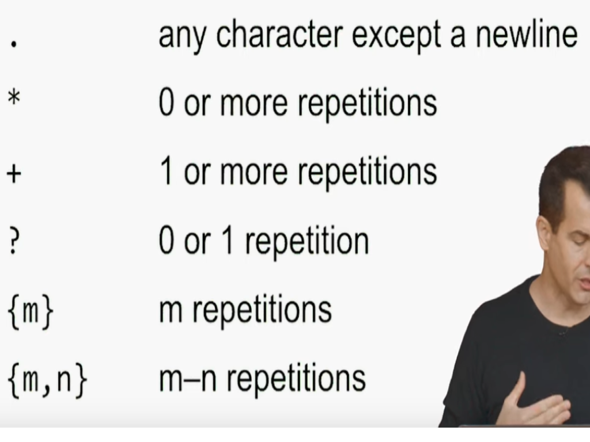

# Python

[Common functions](#common-functions)
[Basics](#basics)
[Conditionals](#conditionals)
[Loops](#loops)
[Random module](#random-module)
[Functions](#functions)
[Error catching](#error-catching)
[Lists](#lists)
[Dictionaries](#dictionaries)
[Json and command line arguments](#json-and-command-line-arguments)
[Correct Main Functions](#correct-main-functions)
[Unit Testing](#unit-testing)
[File I/O](#file-i/o)
[csv files](#csv-files)
[Re Library(Regular Expressions)](#re-library(regular expressions))
[Object-Oriented Programming](#object-oriented-programming)
[Inheritance](#inheritance)
[Sets](#sets)
[Unpacking lists](#unpacking-lists)
[Args and Kwargs](#args-and-kwargs)


### Common functions

- **sorted(list)** returns a sorted list
  - Syntax: **sorted(list, key=someFunc)**
  - The function passed in can be used to tell sorted how to sort the data
- **.sort()** sorts the original list directly
  - Can do **.sort(reverse=True)** if you want the list sorted in descending order
- **.strip()** removes leading and trailing whitespace
  - Can also use **.rstrip()** and **.lstrip()** if you only want the leading or only the trailing whitespace taken off
- **.split(ch)** can split a string at the given character and return a list
  - Ex. **“hello,hi,hey”.split(“,”)** returns a list of each comma separated string
- **.endswith(<some str or ch>)** checks to make sure that a string ends with what is asked and returns a boolean value
  - Ex. **“hello”.endswith(“lo”)** would return True
- **map(function, iterable, …)** allows you to map a function to every item in the iterable
  - Ex. **uppercased = map(str.upper, words)**

### Basics

- **print()** for printing
  - Ex. **print(“Hello world!”)**
  - Syntax: **print(\*objects, sep=’ ‘, end = ‘\n’)**
- **input()** for taking input. Always returns a string
  - Ex. **myName = input(“What is your name?: “)**
- Can parse using things like **int()** or **str()** or **float()** \*
  - Ex. **int(‘6’)**
- **len()** for getting the length of a string
  - Ex. **len(“Hello”)** returns 5
- Boolean values are **True** and **False** and **None**

### Conditionals

- Comparison operators you can use
  - **and**
    - Ex. True and False returns False
  - **or**
    - Ex. True or False returns True
  - **not**
    - not True returns False
  - **!=**
  - **==**
  - **<**
  - **>**
  - **<=**
  - **>=**
- Can use if, elif, or else statements
- The **in** keyword allows you to check if a characters or string of characters is in a list, tuple, string, or dictionary
  - Ex. **if “@” in email:**

### Loops

- **while <condition>:**
  - Can use **break** to get out of loop
  - Can use **continue** to continue to the next iteration of the loop
- **for someVariable in range(someNum):**
  - Goes from 0 up to but not including num
- Can also do **for someVariable in range(start, end):**
  - Goes from start up to but not including end
- Can also do **for var in range(start, end, step):**
  - Step is how much to increment by
  - Can input -1 for step to count backwards
- To loop through a list, you can do **for var in list:**
  - If you want to apply something to every var in the list in one go, you can do **someFunction for var in list**
    - Ex. **word.upper() for word in words:**

### Random module

- **import random**
  - Can do **from random import \*** so that you don’t have to do random. in front of functions. It’s better not to do this for readability
- **random.randint(<start>, <end>)**
  - Gives a random integer between start to end
- **random.choice(<some list, tuple, or range of values>)** picks a random value from the sequence given

### Functions

- **def functionName(<parameters>...):**
- Call a function by **functionName(<arguments>...)**
- Can create unnamed functions using the **lambda** keyword
  - Syntax: **lambda params, …: returnStatement**
  - Ex. **lambda student: student[“name”]**

### Error catching

- **try:**
- **except <ErrorName>:**
- The **raise** keyword is used to raise an exception
  - Ex. **raise ValueError(“Missing name”)**

### Lists

- **Ex. spam = [‘cat’, ‘bat’, ‘rat’]**
- Can get data from list using indexing: **spam[0]** which would equal **cat**
  - Can do negative indexes to go from the back like **spam[-1]** is **rat**
- Slicing a list allows us to get multiple values
  - Ex. **spam[1:3]** would give us **[‘bat’, ‘rat’]**
  - Can do **spam[:2]** to start from the beginning and going up to index 1
  - Can do **spam[2:]** to start from index 2 and go to the end
- Can delete from a list using del
  - Ex. **del spam[2]**
- Can use **list()** function to change a string to a list
  - Ex. **list(“Hello”)** returns **[“H”, “e”, “l”, “l”, “o”]**
- Can use the **in** keyword to see if an item is in a list
  - Ex. **‘hi’ in [‘yo’, ‘hi’, ‘hello’]**
- Can use for loops with lists
  - Ex. **for i in [1,2,3,4]**
- Can add to list using **.append()** which adds a value to the end
  - Ex. **list.append(“apple”)**
  - 

### Dictionaries

- Dictionaries are used to store data in key value pairs
- Dictionary items are ordered, changeable, and do not allow duplicates
```python
thisdict {
  "brand": "Ford",
  "model": "Mustang",
  "year": 1964
}
```
- Items are called by the key name: **thisdict["brand"]**
- The len() function can be used to get the length of a dictionary
  - **len(thisdict)**

### Json and command line arguments

- Can do **import sys**
  - Gives access to **sys.argv** which is a list of all the command line arguments
- Can do **import requests**
  - Allows you to do **requests.get(<some url>)** which gives a request object full of data back from the url
- Can do **import json**
  - Allows you to turn data into json format which allows for nicer reading and manipulating with **.json()**

### Correct Main Function

- To correctly have a main function in python, it needs to be done like this:
  - **if \_\_name\_\_ == “\_\_main\_\_”:**
- **\_\_name\_\_** holds the name of the current module
- **\_\_main\_\_** is the name of the scope where top-level code executes
  - When a python file is run directly, the interpreter assings the string “\_\_main\_\_” to the built in \_\_name\_\_ variable of that file.

### Unit Testing

- Use **assert** statements to test
  - Ex. **assert square(3) == 9**
- Can install pytest using pip to allow for more readable output when testing
  - No need for a main method anymore
  - Called on the command line instead of python
    - Ex. **pytest test_calculator.py**

### File I/O

- To open a file, use the **open()** function with syntax: **open(“filename”, <“r”, “w”, “a”> )**
  - This returns a file object to use so you should assign to a variable when using open()
  - **r** is for reading mode which is also the default mode when opening so no need to specify
    - **.readlines()** is a method that reads all the lines in a file and returns a list
    - Can also just iterate over the lines in a file using **for line in file:**
  - **w** is for writing mode which creates a file and allows you to write to it. Overwrites a file if it already exists
    - To write to a file, use the **.write(var)** function
      - Ex. **file.write(name)**
  - **a** is for append mode which creates a file and allows you to add to a file instead of overwriting
  - Ex. **file = open(“names.txt”, “w”)**
- To close a file, do **file.close()** which saves the file
- If you don’t want to manually close the file, you could use the **with** keyword
  - Ex. **with open(“names.txt”, “w”) as file:**

### csv files

- Can **import csv** to work with some csv functions to make reading files easier
- **csv.reader(file)** allows for much easier handling of gathering data
- **csv.writer(file)** allows for writing to csv files and creating neat output
  - Can use **writer.writerow([var, var, …])** to write to a csv file

### Re Library(Regular Expressions)



- The **re.search(pattern, string, flags=0)** function searches for items in a string using certain patterns
  - Ex. **re.search(“.+@.+”, email)** would make sure that an email has one or more characters before the @, then one or more characters after the @
  - You can also put an “r” in front of the quotes to make python interpret it as a raw string
    - Ex. **re.search(r”.+@.+\.edu”, email)** which would make the function allow the backslash to not be a literal backslash to look for, but a normal python backslash that allows a period to be looked for
  - You can also add a “^” at the start to indicate the start of the string and a “$” at the end to indicate the end of the string
    - Ex. **re.search(r”^.+@.+\.edu$”, email)**
  - **[]** can be used to restrict the input to a set of characters that you want and **[^]** can be used to represent anything BUT what is in the brackets
    - Ex. **re.search(r”^[a-zA-Z0-9_]+@[a-zA-Z0-9_]+\.edu”, email)**
- You can also use \w to represent a word character which is alnum plus \_

### Object-Oriented Programming

- **To create a class object, use the **class\*\* keyword
  - Ex. **class Student:**
- When initializing the instance variables for a class, initialize them in the **\_\_init\_\_** function
  - Syntax: **def \_\_init\_\_(self, param, …):**
  - Ex. **def \_\_init\_\_(self, name, house):**
    - **self.name = name**
    - **self.house = house**
- To create an instance of this class, do **student = Student(“Harry”, “Gryffindor”)**
- The **\_\_str\_\_** function can be used in a class to provide a string representation for the class data
  - **Ex. def \_\_str\_\_(self):**
    - **return f”{self.name} from {self.house}”**
- **@property** can be put above a getter method in order for it to be called anytime that instance variable is accessed. This is where error checking should be done
  - When returning the variable, it is common convention to use an underscore in front of the variable so they variable names don’t collide
  - **@property**
  - **def house(self):**
    - **return self.\_house**
- **@<attribute_name>.setter** is used to create a setter method and where error checking should be done as well
  - **@house.setter**
  - **def house(self, house):**
    - **self.\_house = house**
- **@classmethod** can be put at the top of a class method in order to allow it to be called without an instance of the class being present
  - Instead of self at the start of the parameters, you put **cls** instead
  - Can be called like **Student.get()**
  - **@classmethod**
  - **def get(cls):**
    - **name = input(“Name: “)**
    - **house = input(“House: “)**
    - **return cls(name, house)**

### Inheritance

- If you would like to inherit the characteristics of a super class, you can create a subclass like this:
  - If the superclass is the class Wizard, then the subclass can be **class Student(Wizard):**
  - When doing the \_\_init\_\_ method for the subclasses and you want inherit the attributes from the superclass, insert **super().\_\_init\_\_(params…)**

### Sets

- Sets are like lists, but they do not allow duplicates
- Can create a set using **var = set()**
- To add to a set, you can do **var.add(item)**

### Unpacking lists

- Lists can be unpacked using an asterisk in order to turn them into a single string
  - Ex. **uppercased = [“This”, “is”, “CS50”]**
  - **print(\*uppercased)** returns **THIS IS CS50** as a string instead of **[“THIS”, “IS”, “CS50”]**

### Args and Kwargs

**\*args** can be used to take in a variable number of arguments for a function - **def f(\*args):** - **print(“Positional: “, args)**

- Called like **f(100, 50, 25, 10)**

- **\*\*kwargs** can be used to take in multiple keyword arguments and returns a dictionary
  - **def f(**kwargs):\*\*
    - **print(“Named:” kwargs)**
- **f(galleons=100, sickles=50, knuts=25);**
